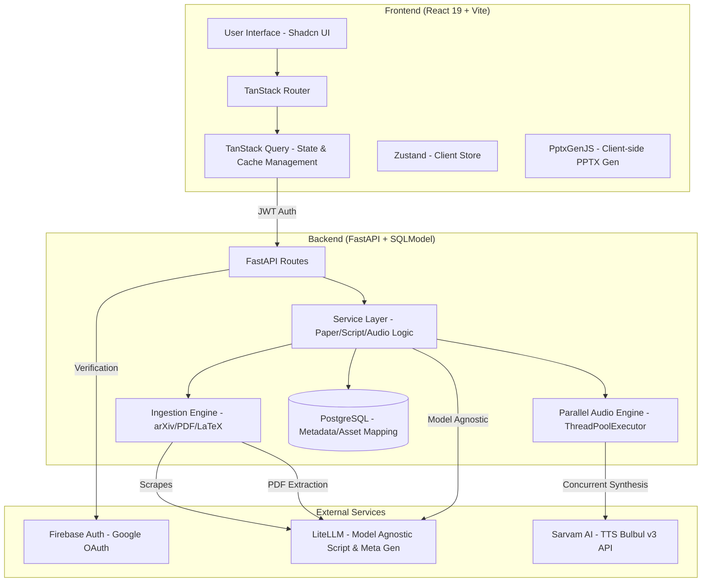

# SARAL — Paper to Presentation

**SARAL** converts research papers (arXiv, LaTeX ZIP, or PDF) into slide presentations with narrated audio, supporting 11 Indian languages.

## Features

- **Multi-source input** — arXiv URL, LaTeX ZIP upload, or PDF upload
- **Standardized Metadata** — LLM-powered extraction of clean title, authors, and year across all formats
- **AI-generated scripts** — section-wise presentation scripts with editable content
- **Model-agnostic LLM** — any provider via LiteLLM: Gemini, OpenAI, Claude, Groq, Ollama
- **Parallel Audio Engine** — Concurrently synthesizes TTS sections for 70% faster generation
- **Client-side slides** — rendered as React components with PPTX download via PptxGenJS
- **11-language TTS** — Sarvam AI Bulbul v3 with 39 voices and localized accent support

## Workflow

1. **Upload** — paste an arXiv URL or upload a ZIP/PDF paper
2. **Scripts** — AI extracts metadata and generates editable section scripts
3. **Slides** — preview auto-generated slides and download as PPTX
4. **Audio** — parallelized TTS generation with real-time progress tracking

## Quick Start

### Prerequisites

- Python 3.11+
- Node.js 20+
- PostgreSQL
- A Firebase project with Google sign-in enabled

### 1. Clone & configure

```bash
git clone https://github.com/yourusername/SARAL.git
cd SARAL
```

### 2. Backend

```bash
cd backend
cp .env.example .env
# Fill in your API keys and Firebase config
python -m venv .venv
source .venv/bin/activate   # Windows: .venv\Scripts\activate
pip install -r requirements.txt
uvicorn app.main:app --reload --port 8000
```

The backend starts at `http://localhost:8000`.

#### Backend environment variables

| Variable                                   | Required | Description                                                                 |
| ------------------------------------------ | -------- | --------------------------------------------------------------------------- |
| `FIREBASE_SERVICE_ACCOUNT_BASE64`          | Yes      | Base64-encoded Firebase service account JSON                                |
| `DATABASE_URL`                             | Yes      | PostgreSQL connection string, e.g. `postgresql://user@localhost:5432/saral` |
| `OPENAI_API_KEY` / `GEMINI_API_KEY` / etc. | Yes      | API key for your chosen LLM provider                                        |
| `LLM_MODEL`                                | No       | LiteLLM model string (default: `gemini/gemini-2.0-flash`)                   |
| `SARVAM_API_KEY`                           | Yes      | Sarvam AI API key for TTS                                                   |
| `CORS_ORIGINS`                             | No       | JSON array of allowed origins (default: `localhost:3000`, `localhost:5173`) |

### 3. Frontend

```bash
cd react-saral
cp .env.example .env
# Fill in Firebase client config and backend URL
npm install
npm run dev
```

The frontend starts at `http://localhost:3000`.

#### Frontend environment variables

| Variable                       | Required | Description                                    |
| ------------------------------ | -------- | ---------------------------------------------- |
| `VITE_API_URL`                 | No       | Backend URL (default: `http://localhost:8000`) |
| `VITE_FIREBASE_API_KEY`        | Yes      | Firebase Web API key                           |
| `VITE_FIREBASE_AUTH_DOMAIN`    | Yes      | Firebase auth domain                           |
| `VITE_FIREBASE_PROJECT_ID`     | Yes      | Firebase project ID                            |
| `VITE_FIREBASE_STORAGE_BUCKET` | Yes      | Firebase storage bucket                        |

### 4. Base64-encode your Firebase service account

```bash
base64 -i path/to/firebase-service-account.json
```

Paste the output into `FIREBASE_SERVICE_ACCOUNT_BASE64` in `backend/.env`.

## Architecture

### System Diagram



### Module Structure

```
backend/
  app/
    main.py            # FastAPI app factory + CORS + lifespan
    config.py          # pydantic-settings (env vars)
    database.py        # SQLModel engine + session (PostgreSQL)
    auth/              # Firebase Admin SDK verification
    models/            # SQLModel tables (User, Paper, Script, Slide, Media, Job)
    schemas/           # Pydantic request/response models
    providers/         # LLM calls (LiteLLM — model-agnostic)
    services/          # Business logic orchestration (Parallel TTS, Ingestion)
    routes/            # FastAPI routers
    utils/             # PDF, arXiv, LaTeX, TTS, slides
```

## API Endpoints

| Method | Path                             | Description                        |
| ------ | -------------------------------- | ---------------------------------- |
| POST   | `/api/auth/google-login`         | Verify Firebase token, upsert user |
| GET    | `/api/auth/me`                   | Get current user                   |
| POST   | `/api/papers/scrape-arxiv`       | Fetch paper from arXiv             |
| POST   | `/api/papers/upload-zip`         | Upload LaTeX ZIP                   |
| POST   | `/api/papers/upload-pdf`         | Upload PDF                         |
| GET    | `/api/papers`                    | List user's papers                 |
| GET    | `/api/papers/{id}`               | Get a specific paper detail        |
| DELETE | `/api/papers/{id}`               | Delete a paper and all its assets  |
| GET    | `/api/scripts/{id}`              | Get scripts for a paper            |
| PUT    | `/api/scripts/{id}`              | Update a script section            |
| GET    | `/api/media/{id}`                | Get generated audio for a paper    |
| POST   | `/api/media/{id}/generate-audio` | Generate per-section TTS audio     |
| GET    | `/api/media/{id}/audio/{file}`   | Stream audio file                  |
| GET    | `/api/media/languages`           | List supported TTS languages       |
| GET    | `/api/media/voices`              | List available TTS voices          |
| GET    | `/api/health`                    | Health check                       |

## Tech Stack

| Layer    | Technology                                                                   |
| -------- | ---------------------------------------------------------------------------- |
| Backend  | FastAPI, SQLModel, PostgreSQL, Firebase Admin SDK                            |
| Frontend | React 19, TanStack Router, TanStack Query, TypeScript, Tailwind CSS, Zustand |
| Slides   | PptxGenJS (client-side PPTX generation + React preview)                      |
| LLM      | Any provider via LiteLLM (Gemini, OpenAI, Anthropic, Groq, Ollama, etc.)     |
| TTS      | Sarvam AI Bulbul v3 (39 voices, 11 languages)                                |
| Auth     | Firebase (Google sign-in)                                                    |

## License

MIT
