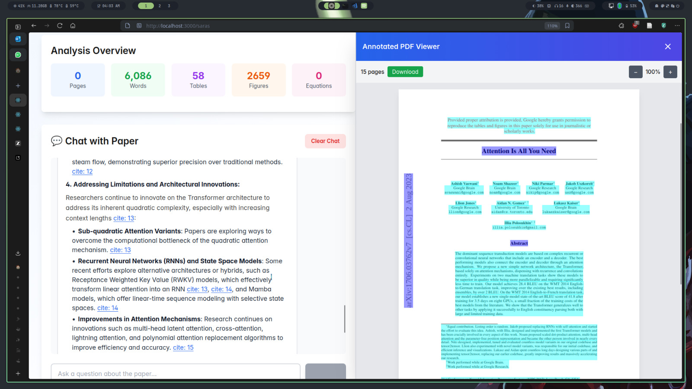
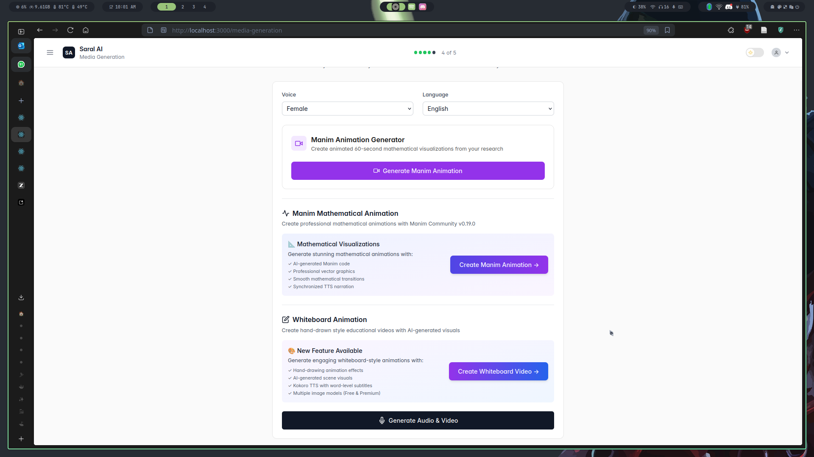
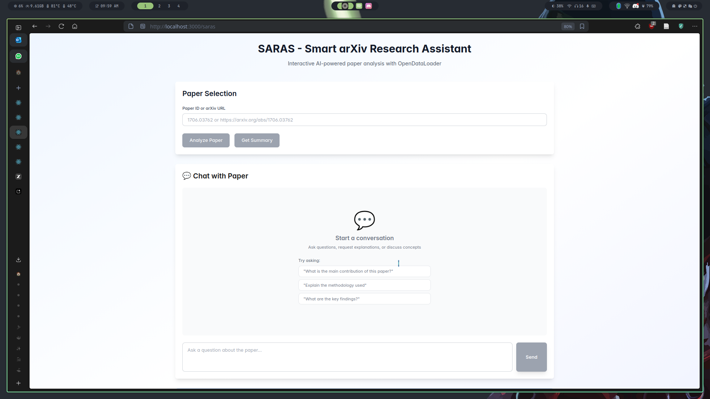
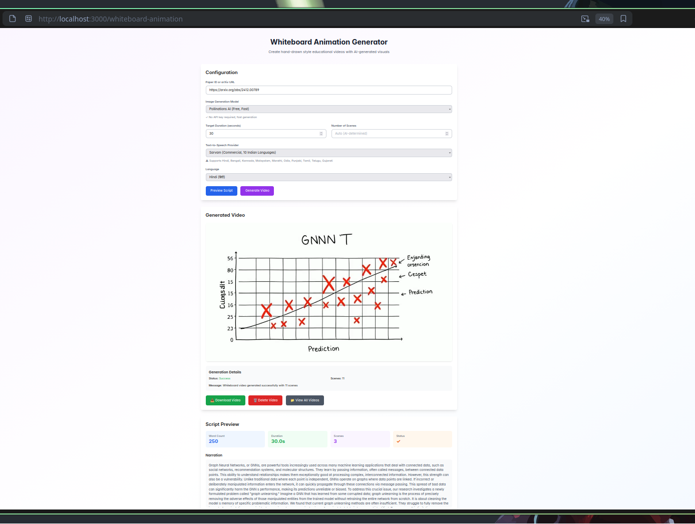
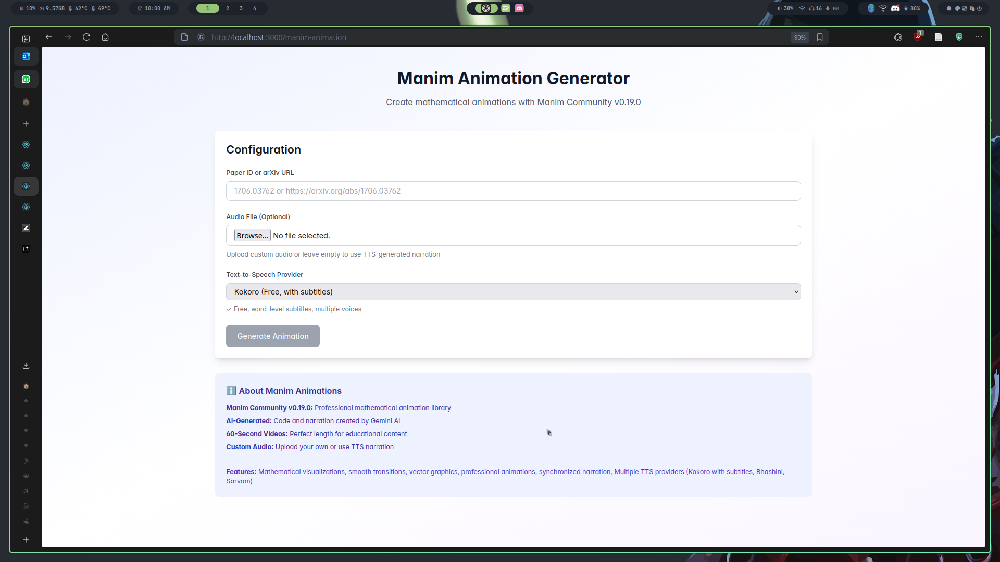

# SARAS

We introduce SARAS, the next step and brother of SARAL, we aim to achieve democraticising research by making research dashboards like Google Scholar, having your own assistant which keeps track of what paper you have read, while having this beautiful interactive UI where reading paper becomes 10x easier!

We also have introduced multiple end-points to generate gneeral audience content, our solution not only serves the General Audience with our beautifully crafted Manim Videos or our Whiteboard Animation videos which could be about any topic, and our Image to Poster pipeline for quick demonstration for Researchers and their day to day use case.

We also target hardcore Researchers to use SARAS, we provide the `/saras` end point which looks something like:



More explanation in the Feature section but to cut it short, our currently implemented platform will be your "Research Assistant" and we believe this is the next step for SARAL!

This will be further enhanced when we add history of which papers read, giving the user ability to connect their previous reading, using google scholar and connecting to get recommendations and having our own algorithm for this.

We present our solution as the base from where SARAL can lift up and rise for researchers along with presenting itself to general-audience interested in research.

More about features implemnted in the `#Features` section.

# Installation Guide

Build on top of SARAL, if you haven't yet set up SARAL, please do that, it is the most important step of setting up. Everything from here will follow from there. So please go @<https://github.com/DemocratiseResearch/SARAL> and build it!

NOTE: Some fixes here and there from SARAL Readme, that might help if you are having trouble.

- please get a GEMINI_API_KEY, it is needed!.
- go to backend and put GEMINI_API_KEY=your_gemini_api_key in a .env file
- also you will need GOOGLE_CLIENT_ID , go to GCP console and create OAuth 2.0 Client IDs credentials, put the client id in the .env file as GOOGLE_CLIENT_ID=your_google_client_id. Make sure localhost:3000 is authorized JavaScript origin.
- you will also need to add the SAME client id in frontend .env ,as REACT_APP_GOOGLE_CLIENT_ID=your_google_client_id
- if you see your backend giving some weird error, correctly setup the postgres db from database.py
- ideally use conda env that I have attached, create it with python 3.10
- Database Initialization:

```
psql -U saral_user -h localhost -p 5432
sudo -u postgres psql
then in the postgresql cmd:
CREATE USER saral_user WITH PASSWORD 'password';
CREATE DATABASE saral_db OWNER saral_user;
  ```

Following the Saral Installation and Database Initialization, now you would have normal SARAL running.

Our Integration End-Points on Frontend can be reached at:

```
/manim-animation
/whiteboard-animation
/saras
/poster-generation
```

Following things on backend are needed to be installed using pip in your backend envrionment:

```
opendataloader-pdf
kokoro
kokoro-onnx
manim
scipy
opencv-python
diffusers
torch
transformers
soundfile
```

For the frontend, it's dead-simple, you just do `npm install`.

# Feature Showcase



## SARAS Chat



Interactive Features

- Section Highlighting: Click on section references in answers to jump to that part in the annotated PDF
- Right-Click to Ask: Select text in PDF, right-click, and ask questions about it directly
- Download PDF: Download the annotated PDF for offline viewing
- Markdown Support: Answers are beautifully formatted with code highlighting, tables, and lists
- Scrollable PDF Viewer: View all pages of the annotated PDF side-by-side while chatting
- Web Search Integration: Ask about recent papers and get AI-powered search results
- Smart Caching: Faster responses with automatic request caching
- OpenDataLoader: Extracts tables, figures, equations, and document structure

## Whiteboard Animations



## Manim Animations


